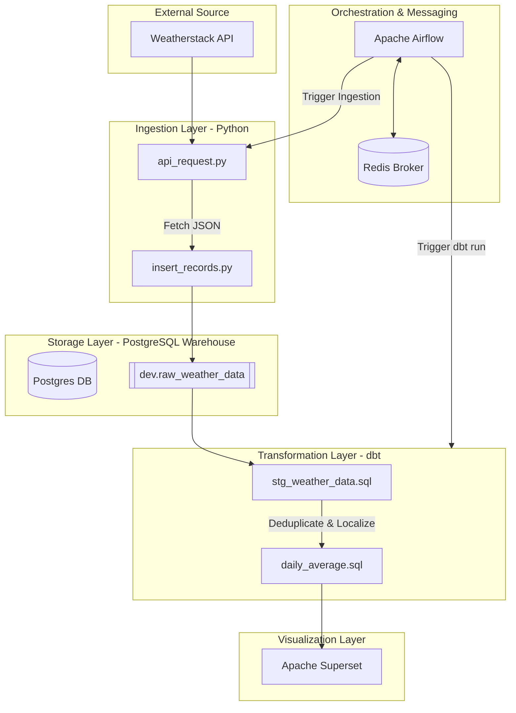

# 🌦️ Weather Data Analytics Pipeline

An end-to-end data engineering pipeline designed to ingest real-time weather data from the Weatherstack API, transform it using dbt, and visualize insights through Apache Superset.

---

## 🛠️ Tech Stack


*   **Languages:** Python, SQL
*   **Orchestration:** Apache Airflow
*   **Transformation:** dbt (Data Build Tool)
*   **Database:** PostgreSQL
*   **Containerization:** Docker & Docker Compose
*   **Messaging/Broker:** Redis
*   **Visualization:** Apache Superset

---

## 🏗️ System Architecture

The following diagram illustrates the data flow from the external API to the final visualization layer:



---

## 🧠 In-Depth Component Breakdown

### 1. The Ingestion Engine (Python & API)
The ingestion layer is built using Python's `requests` library. 
*   **Logic:** It performs a synchronous GET request to Weatherstack. 
*   **Database Interaction:** Instead of just dumping JSON, `insert_records.py` uses `psycopg2` to ensure the `dev` schema exists and creates the `raw_weather_data` table if it's missing. It appends a `utc_offset` and a `NOW()` timestamp to every record to handle time-series analysis later.

### 2. The Orchestrator (Airflow & Redis)
**Apache Airflow** acts as the brain of the pipeline.
*   **Redis's Role:** Redis serves as the **Message Broker**. When Airflow schedules a task, it pushes a message to Redis. An Airflow Worker then pulls that message to execute the task. This ensures that even if the web server goes down, the task queue remains intact.
*   **Task Dependencies:** The DAG enforces a strict "Ingest-then-Transform" policy. If the Python ingestion fails, the dbt transformation will not trigger, preventing stale or null data processing.

### 3. Transformation Layer (dbt & Docker)
We use an **ELT (Extract, Load, Transform)** approach. Data is loaded raw into Postgres and then transformed using dbt.
*   **Docker-out-of-Docker (DooD):** The Airflow DAG uses the `DockerOperator`. By mounting `/var/run/docker.sock`, the Airflow container can spin up a *sibling* container running `dbt-postgres`.
*   **Staging (`stg_weather_data`)**: This model handles the "dirty" work. It uses a Window Function (`row_number()`) to deduplicate records based on the API's `time` field. It also converts the system insertion time to the city's local time using the `utc_offset`.
*   **Mart (`daily_average`)**: This is the final "Gold" layer. It aggregates the cleaned data to provide high-level metrics (average temp/wind) used by the business layer.

### 4. Storage & Visualization (Postgres & Superset)
*   **PostgreSQL:** Serves as the single source of truth. It stores the raw JSON-like rows, the staged views, and the final aggregated tables.
*   **Apache Superset:** Connects directly to the `daily_average` table. Because dbt materializes this as a **Table** (not a view), Superset queries are lightning-fast as they don't require re-calculating averages on every dashboard refresh.

---

## 🛠️ Advanced Configuration: Docker Mounting
To keep the dbt logic separate from the orchestration logic, we bind-mount the dbt project into the Docker container at runtime:
```python
Mount(
    source='/home/sagar/repos/weather-data-project/dbt/my_project', 
    target='/usr/app/', 
    type='bind'
)
```
This allows you to update your SQL models without needing to rebuild your Docker images.

## 📂 Project Structure

*   **`api-request/`**: Contains Python scripts for interacting with the Weatherstack API and handling initial database inserts.
*   **`airflow/`**: Contains the DAG definitions to schedule and monitor the pipeline.
*   **`dbt/`**: Contains the dbt project, including staging models, data marts, and source configurations.
*   **`docker-compose.yml`**: Orchestrates the various services (Postgres, Airflow, Superset).

---

## 🚀 Pipeline Workflow

### 1. Data Ingestion
The pipeline starts with a Python-based ingestion process:
*   **`api_request.py`**: Authenticates with the Weatherstack API and retrieves current weather data for New York.
*   **`insert_records.py`**: Establishes a connection to the PostgreSQL instance, ensures the `dev.raw_weather_data` table exists, and appends the new JSON record with an insertion timestamp.

### 2. Orchestration
**Apache Airflow** manages the workflow via the `weather-api-dbt-orchestrator` DAG:
*   **Schedule:** Runs every minute (`timedelta(minutes=1)`).
*   **Task 1 (`ingest_data_task_1`):** Executes the Python ingestion script.
*   **Task 2 (`transform_data_task`):** Uses a `DockerOperator` to spin up a dbt container and execute `dbt run`, ensuring transformations happen immediately after data lands.

### 3. Data Transformation (dbt)
Data is transformed in two stages within the Postgres `dev` schema:
*   **Staging (`stg_weather_data`)**: 
    *   Deduplicates records based on the API's observation time.
    *   Calculates `inserted_at_local` by applying the `utc_offset` to the system timestamp.
*   **Mart (`daily_average`)**: 
    *   Aggregates data to a daily grain.
    *   Calculates the average temperature and wind speed per city per day.

### 4. Visualization
The final `daily_average` table is connected to **Apache Superset**, where dashboards track:
*   Temperature trends over time.
*   Average wind speed comparisons.
*   Real-time weather status updates.

---

## 🔧 Setup & Installation

1.  **Clone the repository:**
    ```bash
    git clone https://github.com/your-repo/weather-data-project.git
    ```
2.  **Configure Environment Variables:** Create a `.env` file with your API keys and database credentials.
3.  **Launch the Stack:**
    ```bash
    docker-compose up -d
    ```
4.  **Access Airflow:** Navigate to `localhost:8080` to enable the orchestrator DAG.